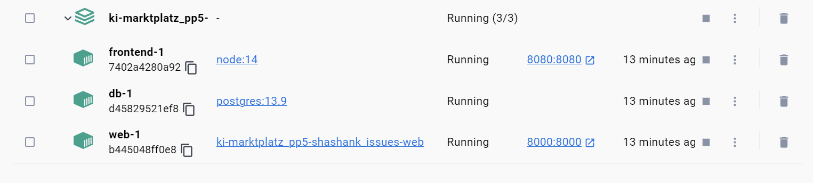
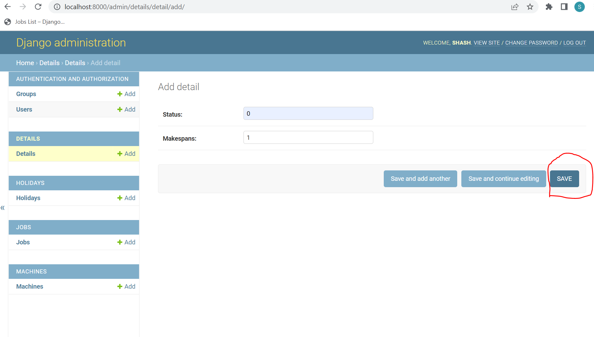

# ARISE prototype

Code for the ARISE prototype.

Status of Main:

## Starting the Django Server and frontend

Open the console and navigate into the root folder of the project and (depending on your system) type `docker compose up` or `docker-compose up`. To shutdown, open a separate terminal tab or window and type `docker compose down` or `docker-compose down` respectively. This should create 3 images "some_folder_name-web" for the django_prototype, node for the frontend and postgres for the database. The containers should also get started and they should typically look like below indicating that django backend server and the frontend can now be started through their respective ports in the localhost.

## Admin console of Django Server and Super User Creation
Step 1: Open the terminal of the web conatiner and type "cd django_prototype" cmd
Step 2: Enter cmd "python manage.py migrate" to migrate the database.
Step 3: Create super user with the cmd "python manage.py createsuperuser --username=some_username --email=some_email" and also enter the passwords after that.
Step 4: Upon successful creation of super user, navigate to this url "http://localhost:8000/admin" and login as an admin. 
Step 5: Create an entry in the Details table  as shown in the below picture.

Step 6: Once done, the frontend app can be started successfully in 8080 port. The jobs  can be imported into the database either through the admin console (http://localhost:8000/admin/jobs/job/import/) or directly through the front end app.

## Code Metrics

If you want information about passed tests, test coverage, and linting, you can do so by creating a merge request. The
merge request will then contain the desired information:

As long as the merge request title begins with `Draft:`, it will not be merged. The test coverage can be viewed in the
diff (click on changes):

A line that has a hit or is just a definition:

A line that is untested:

# Installation local package

Gehe in den Ornder darüber und schreibe pip install -e arise-prototype importiere das package dann mit arise_prototype
Code for the ARISE prototype
