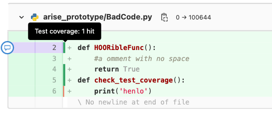

# ARISE prototype

Code for the ARISE prototype.

Status of Main:

## Starting the Django Server

Open the console and navigate into the folder `django_prototype` and (depending on your system) type `docker compose up`
or `docker-compose up`. To shutdown, open a separate terminal tab or window and type `docker compose down`
or `docker-compose down`
respectively.

## Starting the frontend
Open the console and navigate into the folder `frontend/src` and type `npm run serve`. In order for this to work you need to have npm and vuejs installed. You can then access the server on the webadress displayed in the console.
You need to have both, the frontend and the Django Server up and running for the webapp to work properly.

## Code Metrics

If you want information about passed tests, test coverage, and linting, you can do so by creating a merge request. The
merge request will then contain the desired information:

As long as the merge request title begins with `Draft:`, it will not be merged. The test coverage can be viewed in the
diff (click on changes):

A line that has a hit or is just a definition:

A line that is untested:

# Installation local package

Gehe in den Ornder darüber und schreibe pip install -e arise-prototype importiere das package dann mit arise_prototype
Code for the ARISE prototype
